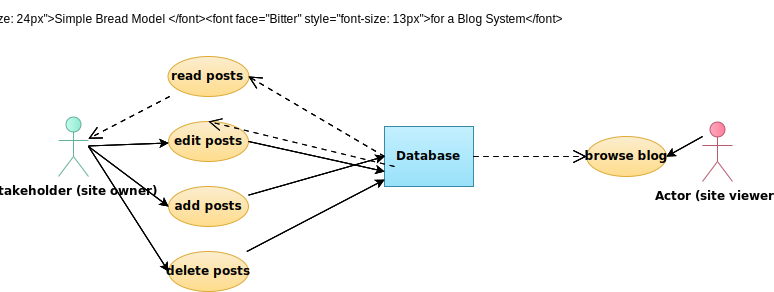
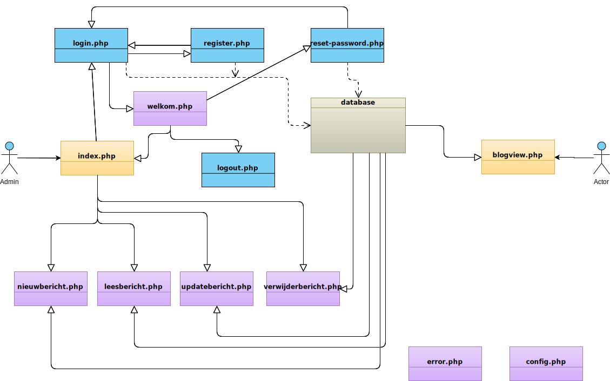

# Weekopdracht_2
Weekopdracht 2 van bootcamp CodeGorilla

| User Stories  | Waar     
| ------------- |:----------------------------------------------------------:|
| W2-001        | index.php -> nieuw bericht.                                | 
| W2-002        | index.php of blogview                                      | 
| W2-003        | lichte server validatie in nieuwbericht en updatebericht   |    
| W2-004        | captcha in nieuwbericht                                    |    

De `index.php` is de entry-file voor het project BasBlog, als er geen user ingelogd is, start `login.php`, van daar uit kan er een gebruiker geregistreerd worden, deze kan vervolgens inloggen en komt dan in het `welkom.php` menu, vandaar uit is de `index.php` bereikbaar, deze kan vervolgens alle functionaliteit benaderen, zoals blogbericht aanmaken, lezen, wijzigen en verwijderen. 
Tevens is de `blogview.php` benaderbaar, echter kan hieruit niet terug genavigeerd worden, omdat dat iets is voor bijvoorbeeld eindgebruikers die het alleen maar kunnen lezen.

De `config.php` verwijst naar een database, die ik bijgevoegd heb in deze repository, `_BASBLOG_.sql` deze is met standaard opties geëxporteerd vanuit MySQL v5.7 via phpMyAdmin v4.8.3.

***
Use Case modelling, gebruikte dit vroeger wel eens om programmatuur uit te schrijven, beetje roestig maar komt wel terug.

***

Bestanden schematisch ingedeeld.

